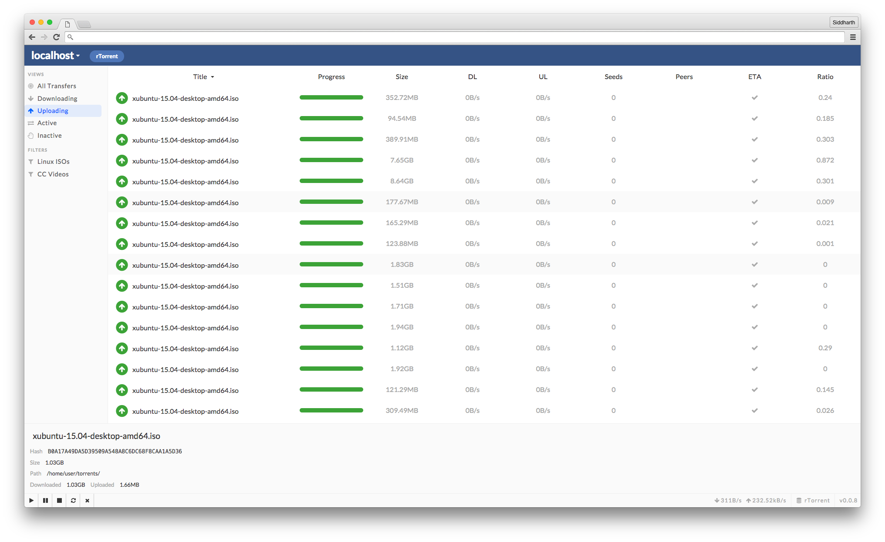

# serene

[](http://standardjs.com/)

Provides a modular and extensible front-end for BitTorrent and WebTorrent daemons. Serene will exist as a web, desktop, and mobile interface. **You don't need node to get started!**

Currently, providers assume that the daemon exists on a server which allows [CORS](http://www.html5rocks.com/en/tutorials/cors/) requests. Preflight requests also need to be handled. It may be worth allowing [JSON-P](http://json-p.org/) requests to reduce configuration headaches.

**This is pre-pre-alpha software under heavy development. Use only if you like tinkering :). Feel free to submit a PR, as nothing is set in stone.**



## note on versioning

v0.0.x are pre-pre-alpha (i.e. every version will potentially introduce breaking changes) versions. v0.x.x (where 0.x > 0.0) represents pre-alpha builds, and breaking changes will result in a semver minor bump (0.>>x<<.x). At some point, v0.x.x builds will be alpha builds.

Beta builds will be clearly tagged as (X.x.x-betaX).

Pre-pre-alpha, and pre-alpha builds are not advised for use on a live server. Nothing can really go wrong, it's just that the upgrade path will likely be painful.

## under the hood

Serene utilizes React + Redux, with the eventual goal/dream of using React Native for the mobile client, and Electron for the desktop client.

As it stands currently, **there is only a web client**, and it is very much a work in progress.

The codebase is bundled with Webpack, using Babel to transpile ES2015 to ES5.

## on modularity & api

Serene is in a ~~extreme-~~mega-ultra-unusable state. The codebase is fairly coupled with rTorrent.

Serene's API is also **nowhere near** being finalized, so please keep that in mind when developing provider interfaces.

## providers (completed & in-progress)

Provider interfaces are lightweight adapters that simply implement a [predictable interface](); we'll just call them providers for short. Essentially, they are dialect definitions that will allow Serene to communicate with a variety of BitTorrent / WebTorrent clients.

- [x] [serene-rtorrent](https://github.com/sidd/serene-rtorrent) (still a work in progress, but is functional!)
- [ ] [serene-webtorrent](https://github.com/sidd/serene-webtorrent) (no functionality, only placeholder functions)
- [ ] serene-deluge

## installation

As of now, everything is installed through helper scripts that utilize npm. This makes adding a provider really easy for Node users, but the eventual idea is to create a bundle which offers Serene + node/npm (i.e. as an Electron app), so that anybody can add providers to their Serene instance.

In order to use a provider, we'll use the included npm `run-script`, (crack open [`package.json`](package.json) to see the npm wizardry that goes on):

```
$ npm run provider:add -- serene-rtorrent # to add a provider
$ npm run provider:remove -- serene-rtorrent # to remove a provider

$ npm run build # creates a new production webpack bundle
```

Don't forget the [getopt delimiter `--`](https://docs.npmjs.com/cli/run-script#description)!

Since you're just serving static files, all you need is a static file server (like [ecstatic](https://npmjs.com/package/ecstatic)). You'll want to serve up the `public/` directory.

## developing

Just run `npm start`, and you're off! This starts a `webpack-dev-server` instance in development mode (with the `-d` flag). [`index.jsx`](assets/index.jsx) is a good starting point.

## short-term roadmap (in ideal chronological order)

- [x] Decouple from rTorrent
- [x] Connect via multiple providers
- [ ] Establish and document interface guidelines
- [ ] Establish plugin architecture
- [ ] Utilize [Notifications API](https://developer.mozilla.org/en-US/docs/Web/API/Notifications_API/Using_the_Notifications_API) for events (i.e. torrent completion, hitting ratio 1)
- [ ] Create a companion lightweight server, which can sit in front of a torrent daemon. This companion will pipe data to Serene client via WebSockets. This would have the added benefits of having less transactional overhead, being able to configure the torrent daemon itself, and allowing for persistence (and useful things like ACL).

One main goal of Serene is to provide a fluid and beautiful user experience out-of-the-box, so that means developing awesome plugins. These will both serve as examples, and also contain useful features that don't need to be bundled in core.

- [ ] Vim keyboard shortcuts (naively implemented basic bindings are in core - should be tossed into a plugin at some point)

## license

MIT
